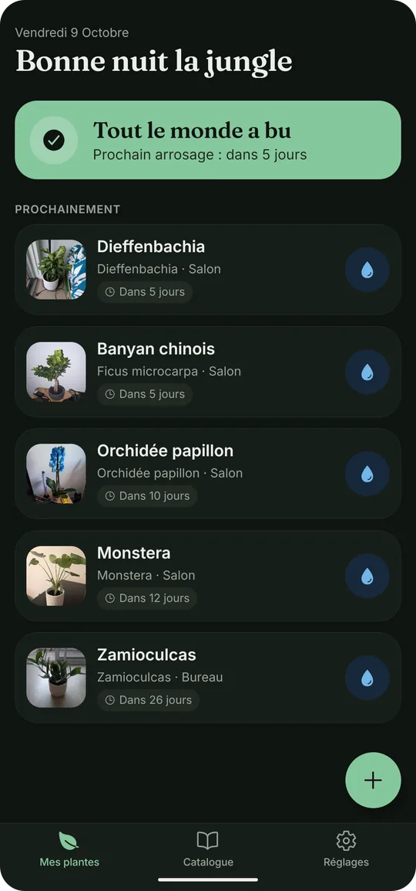
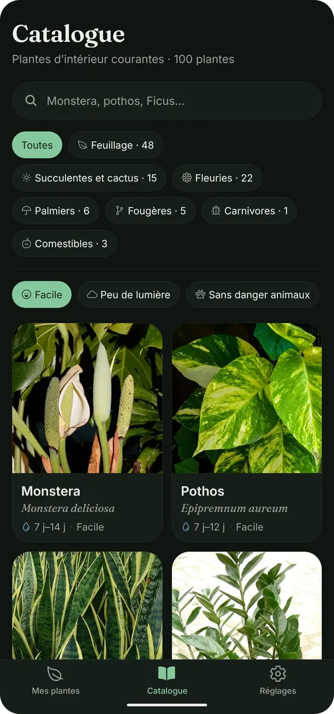

# Rooots 🌱

**Parce que tout le monde peut avoir la main verte.**

Rooots sait quand chacune de vos plantes a soif, selon son espèce et la saison, et vous le rappelle chaque jour à l'heure qui vous arrange.

  
  &nbsp;&nbsp;
  

## Ce que fait Rooots

- 💧 **Le bon rythme d'arrosage** pour chaque plante, ajusté entre l'été et l'hiver, ou à votre façon.
- 🔔 **Un seul rappel par jour**, à l'heure choisie, et seulement quand une plante a vraiment soif.
- 📖 **Un catalogue de 100 plantes d'intérieur** : lumière, humidité, température, terreau, rempotage, conseils et problèmes fréquents.
- 🐾 **Sans danger pour vos animaux ?** La toxicité pour les chats et les chiens est indiquée pour chaque plante.
- 🔎 **Trouver la plante qu'il vous faut** : facile à vivre, peu de lumière, sans danger pour les animaux…
- 📝 **L'historique des soins** : arrosage, engrais, rempotage, taille, avec la possibilité de noter un soin oublié.
- 📸 **Vos plantes en photo**, avec leur petit nom et leur place dans la maison.
